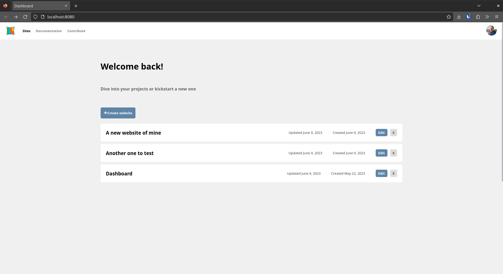

# Silex Dashboard

Dashboard plugin for managing websites in Silex. Built with 11ty and Vue.js, it provides a UI to create, list and manage your Silex sites.

Technically, the dashboard is an [11ty](https://11ty.dev) website with a design made in Silex + [a vue.js app](https://vuejs.org/) which interacts with Silex API



For discussions and bug report please go to [Silex main project](https://github.com/silexlabs/Silex)

## Development

To contribute to this project:

1. **Clone the Repository**:
   ```bash
   git clone https://github.com/silexlabs/silex-dashboard.git
   cd silex-dashboard
   ```

2. **Install Dependencies**:
   ```bash
   npm install
   ```

3. **Build the Project**:
   ```bash
   npm run build
   ```

## Contribute

Start Tina CMS

```sh
$ npm run tina:dev
```

In another terminal, start Silex and 11ty

```sh
$ npm start
```

Use these links

* Silex editor: http://localhost:6805
* Silex dashboard: http://localhost:6805/en/
* Silex connectors: http://localhost:6805/en/connectors/
